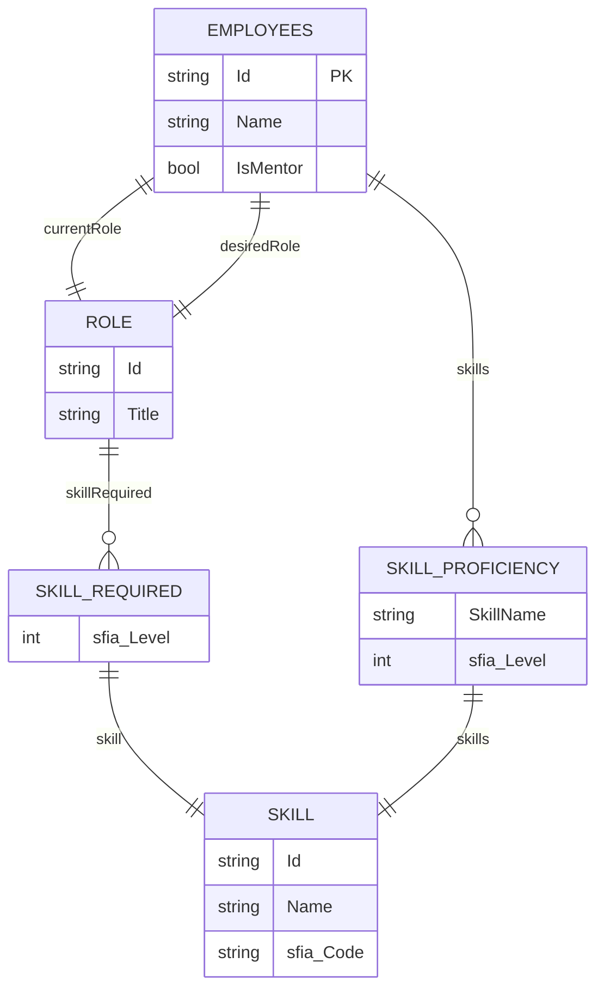
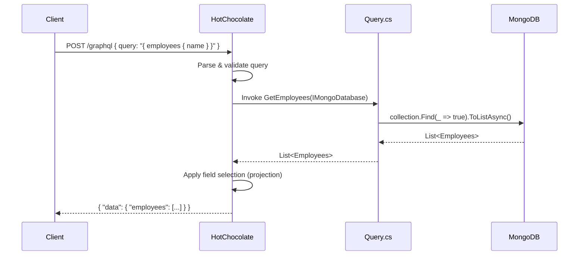
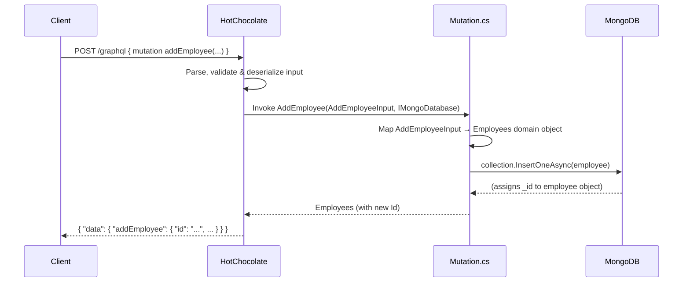
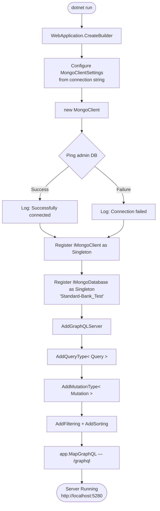
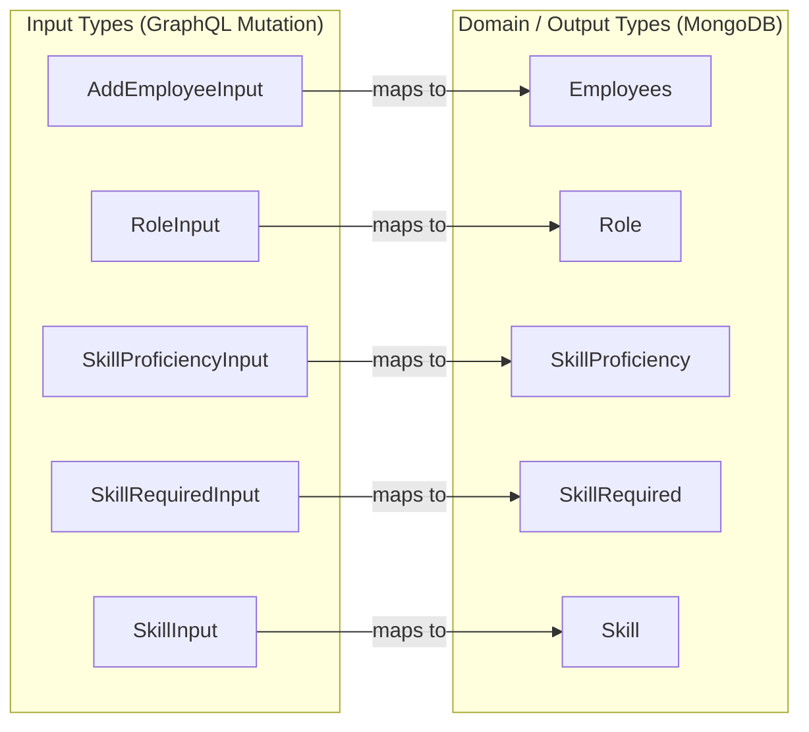

# 🍫 GraphQL.Net Server — Employee Skills API
* After a successful Python prototype that the Lead Solution Architect approved, I went on to build the .Net Version for its scalability as part of a production ready POC/MVP.
---
A **GraphQL API** built with [HotChocolate](https://chillicream.com/docs/hotchocolate) on **.NET 9** and **MongoDB Atlas**, designed to manage employees, their current roles, desired roles, and SFIA skill proficiencies.

## 📋 Table of Contents

- [Overview](#overview)
- [Tech Stack](#tech-stack)
- [Project Structure](#project-structure)
- [Data Model](#data-model)
- [GraphQL Schema](#graphql-schema)
- [API Operations](#api-operations)
- [Request Flow](#request-flow)
- [Getting Started](#getting-started)
- [Example Queries](#example-queries)
- [Known Issues & Notes](#known-issues--notes)

---

## Overview

This server exposes a GraphQL endpoint that allows clients to **query** and **mutate** employee records stored in a MongoDB Atlas cluster. Each employee has a current role, a desired (target) role, and a list of personal skill proficiencies — all mapped to the [SFIA (Skills Framework for the Information Age)](https://sfia-online.org) standard using codes and levels.

The API is built code-first using HotChocolate's annotation-based approach, with filtering and sorting enabled out of the box.

---

## Tech Stack

| Layer | Technology |
|---|---|
| Runtime | .NET 9 (ASP.NET Core) |
| GraphQL Server | HotChocolate v15.1.10 |
| Database | MongoDB Atlas (Driver v3.5.0) |
| GraphQL IDE | Nitro (Banana Cake Pop) — bundled |
| Dev IDE | VS Code |
| Language | C# 13 (nullable enabled) |

---

## Project Structure

```
GraphQL.Net Server/
├── Program.cs                    # App bootstrap, DI, MongoDB + GraphQL setup
├── GraphQLOps/
│   ├── Query.cs                  # All read operations (queries)
│   └── Mutation.cs               # All write operations (mutations)
└── Models/
    ├── Employees.cs              # MongoDB document model
    ├── Role.cs                   # Embedded role document
    ├── Skill.cs                  # Skill reference (name + SFIA code)
    ├── SkillProficiency.cs       # Employee's personal skill + level
    ├── SkillRequired.cs          # Skill requirement on a role
    ├── AddEmployeeInput.cs       # Mutation input type
    ├── RoleInput.cs              # Nested input for role
    ├── SkillInput.cs             # Nested input for skill
    ├── SkillProficiencyInput.cs  # Nested input for proficiency
    └── SkillRequiredInput.cs     # Nested input for skill requirement
```

---

## Data Model

The domain is centred on an `Employee` document. Each employee embeds two `Role` documents (current and desired) and a list of personal `SkillProficiency` entries. Each role in turn embeds a list of `SkillRequired` entries, and each of those references a `Skill` object.

### Entity Relationship Diagram



### MongoDB Document Shape

Because this is a document database, the `Employee` document is fully **denormalised** — roles and skills are embedded directly rather than referenced by foreign key. This is what a stored document looks like conceptually:

```json
{
  "_id": "ObjectId(...)",
  "name": "Jane Doe",
  "ismentor": true,
  "currentrole": {
    "_id": "ObjectId(...)",
    "title": "Software Engineer",
    "skillrequired": [
      {
        "skill": { "name": "Software Development", "sfia_code": "PROG" },
        "sfia_level": 4
      }
    ]
  },
  "desiredrole": {
    "_id": "ObjectId(...)",
    "title": "Tech Lead",
    "skillrequired": [
      {
        "skill": { "name": "Systems Design", "sfia_code": "ARCH" },
        "sfia_level": 5
      }
    ]
  },
  "skills": [
    {
      "skillname": "Software Development",
      "sfia_level": 4,
      "skills": { "name": "Software Development", "sfia_code": "PROG" }
    }
  ]
}
```

---

## GraphQL Schema

The schema is generated automatically by HotChocolate at runtime from your C# types. Here is the conceptual SDL representation:

```graphql
type Employees {
  id: String
  name: String
  currentRole: Role
  desiredRole: Role
  skills: [SkillProficiency]
  isMentor: Boolean
}

type Role {
  id: String
  title: String
  skillRequired: [SkillRequired]
}

type SkillRequired {
  skill: Skill
  sfia_Level: Int
}

type SkillProficiency {
  skillName: String
  sfia_Level: Int
  skills: Skill
}

type Skill {
  id: String
  name: String
  sfia_Code: String
}

type Query {
  employees: [Employees!]!
  employeeById(id: String!): Employees
}

type Mutation {
  addEmployee(input: AddEmployeeInput!): Employees!
}
```

---

## API Operations

### Queries

**`employees`** — Returns all employee documents from the `Employees` collection. This operation supports filtering and sorting, which are enabled via HotChocolate's `.AddFiltering()` and `.AddSorting()` middleware.

**`employeeById(id)`** — Returns a single employee by their MongoDB ObjectId string. Returns `null` if no match is found.

### Mutations

**`addEmployee(input)`** — Inserts a new employee document into the collection and returns the created document, including the MongoDB-generated `_id`.

The `AddEmployeeInput` type mirrors the full `Employees` shape, using separate `*Input` types for all nested objects. This separation between the domain model and the input model is important — it prevents HotChocolate from exposing MongoDB BSON attributes (like `[BsonId]`) on the input side of the schema.

---

## Request Flow

### Query Flow

The following diagram traces what happens from the moment a client sends a `employees` query to when the response is returned.



### Mutation Flow



### Application Bootstrap Flow

This shows how `Program.cs` wires everything together on startup.



---

## Input Type Mapping

One design pattern worth understanding is the **two-type system** this API uses for every entity. HotChocolate needs separate classes for *output types* (returned from queries) and *input types* (accepted by mutations). The mapping happens manually inside `Mutation.cs`.



---

## Getting Started

### Prerequisites

You will need the [.NET 9 SDK](https://dotnet.microsoft.com/download/dotnet/9.0) installed, and network access to the MongoDB Atlas cluster configured in `Program.cs`.

### Running the Server

```bash
# Clone the repository
git clone <your-repo-url>
cd "GraphQL.Net Server"

# Restore packages and run
dotnet run
```

The server will start at `http://localhost:5280`. You can open the **Nitro GraphQL IDE** by navigating to `http://localhost:5280/graphql` in your browser — it is bundled automatically with HotChocolate.AspNetCore.

### HTTPS

To run with HTTPS (recommended for production), use:

```bash
dotnet run --launch-profile https
# Runs at https://localhost:7228
```

---

## Example Queries

### Fetch All Employees

```graphql
query GetAllEmployees {
  employees {
    id
    name
    isMentor
    currentRole {
      title
      skillRequired {
        skill {
          name
          sfia_Code
        }
        sfia_Level
      }
    }
    desiredRole {
      title
    }
    skills {
      skillName
      sfia_Level
      skills {
        sfia_Code
      }
    }
  }
}
```

### Fetch Employee by ID

```graphql
query GetEmployee {
  employeeById(id: "64f1a2b3c4d5e6f7a8b9c0d1") {
    name
    currentRole {
      title
    }
    desiredRole {
      title
    }
  }
}
```

### Add a New Employee

```graphql
mutation CreateEmployee {
  addEmployee(input: {
    name: "Jane Doe"
    isMentor: false
    currentRole: {
      id: ""
      title: "Junior Developer"
      skillRequired: [
        {
          skill: { id: "", name: "Programming", sfia_Code: "PROG" }
          sfia_Level: 3
        }
      ]
    }
    desiredRole: {
      id: ""
      title: "Senior Developer"
      skillRequired: [
        {
          skill: { id: "", name: "Systems Design", sfia_Code: "ARCH" }
          sfia_Level: 5
        }
      ]
    }
    skills: [
      {
        skillName: "Programming"
        sfia_Level: 3
        skills: { id: "", name: "Programming", sfia_Code: "PROG" }
      }
    ]
  }) {
    id
    name
    currentRole {
      title
    }
  }
}
```

---

## Known Issues & Notes

**Collection name mismatch.** There is a bug in the current codebase worth flagging: `Mutation.cs` inserts documents into a collection named `"Employee"` (singular), while both methods in `Query.cs` read from `"Employees"` (plural). This means that documents added via the mutation will not appear in query results. Both should use the same collection name — `"Employees"` is the more conventional choice.

**Connection string in source code.** The MongoDB Atlas connection URI (including credentials) is hardcoded in `Program.cs`. Before pushing to a public repository, this should be moved to `appsettings.json` or — better still — to environment variables or a secrets manager, and the raw credentials should be rotated.

**No authentication or authorisation.** The GraphQL endpoint is currently open with no auth layer. HotChocolate ships with a built-in `@authorize` directive that integrates with ASP.NET Core's policy-based auth system, which would be the natural next step.

**Filtering and sorting are registered but not yet decorated.** The `.AddFiltering()` and `.AddSorting()` calls in `Program.cs` enable the middleware, but the resolver methods in `Query.cs` need `[UseFiltering]` and `[UseSorting]` attribute decorators to actually expose those capabilities to clients.

---

## Dependencies

| Package | Version | Purpose |
|---|---|---|
| `HotChocolate.AspNetCore` | 15.1.10 | GraphQL server + Nitro IDE |
| `HotChocolate.Data` | 15.1.10 | Filtering, sorting, projections |
| `MongoDB.Driver` | 3.5.0 | MongoDB Atlas client |

---

*Built with .NET 9 · HotChocolate 15 · MongoDB Atlas*
