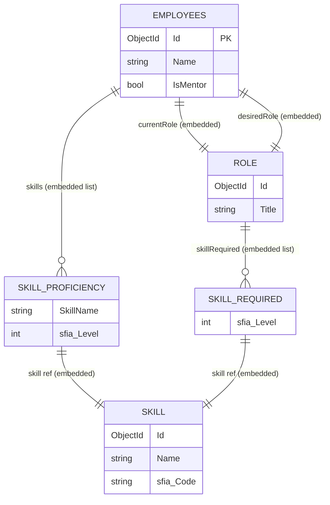
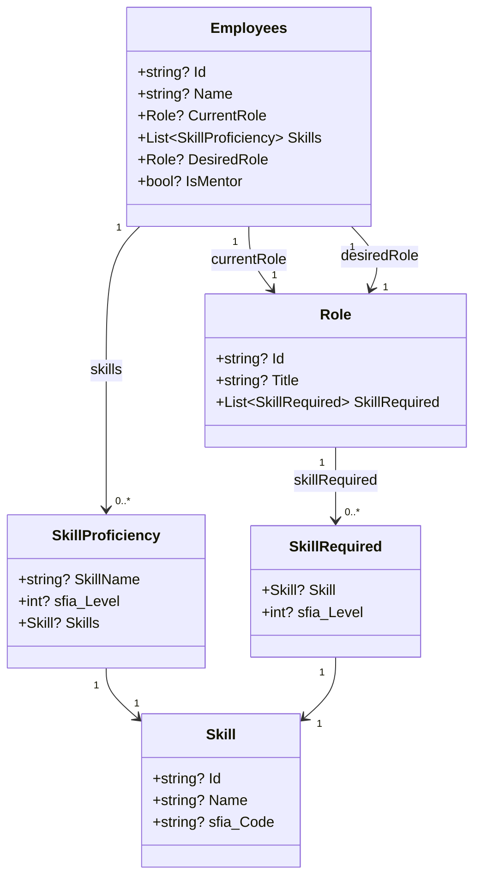
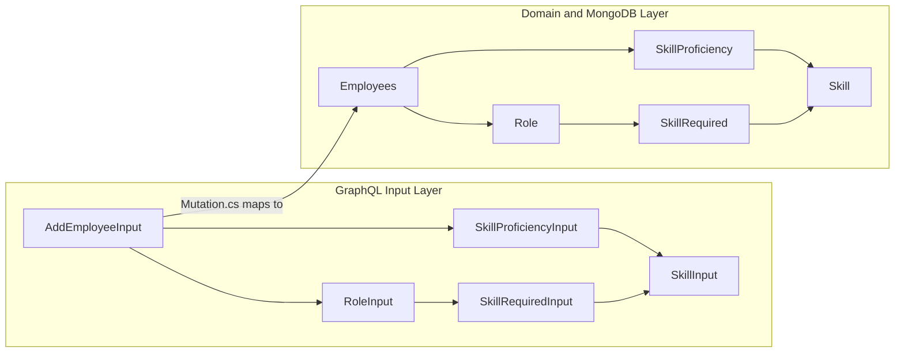
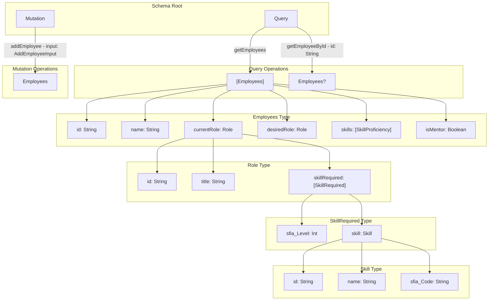
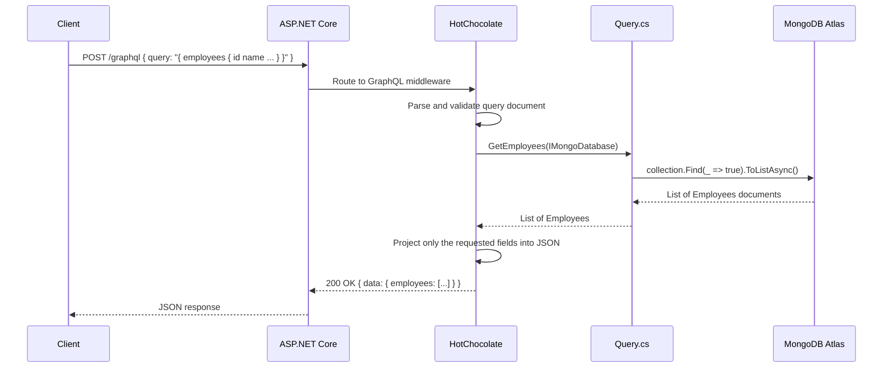
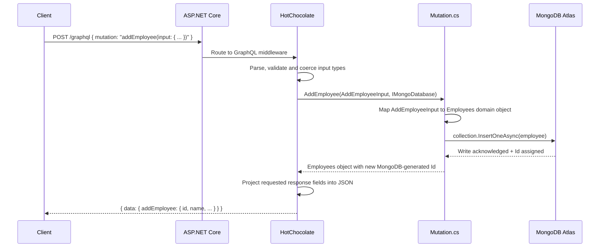
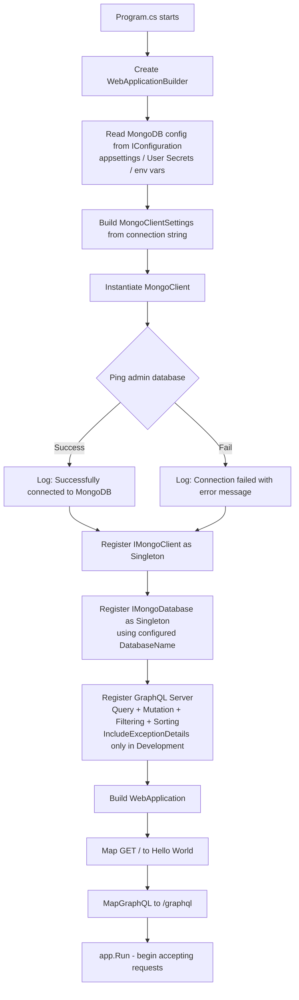
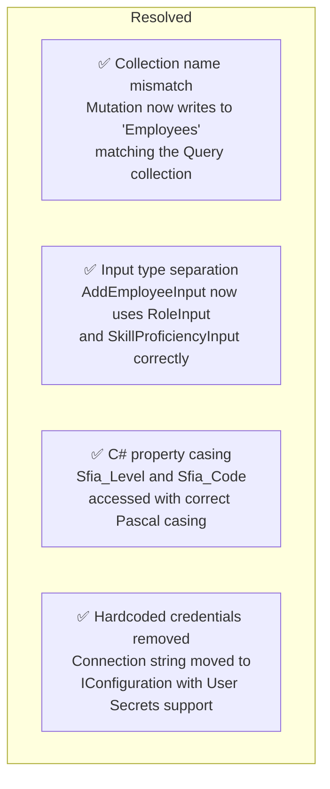

# GraphQL .NET Server — Employee Skills API
* After a successful Python prototype that the Lead Solution Architect approved, I went on to build the .Net Version for its scalability as part of a production ready POC/MVP.
---
A **GraphQL API** built with [Hot Chocolate](https://chillicream.com/docs/hotchocolate) on ASP.NET Core 9 and MongoDB, designed to manage employees, their current roles, desired roles, and SFIA skill proficiencies.

> **Note on credentials:** An earlier version of this repository contained a MongoDB Atlas connection string as part of a fictional client scenario used for development and demonstration purposes only. The fictional client — **Standard Bank (SBSA-Test)** — and all associated connection details were placeholder values created specifically to give the project a realistic, professional context during its initial build phase. Those credentials have since been removed from the codebase and replaced with a secure configuration-driven approach. No real client data was ever at risk.

---

## Table of Contents

- [Overview](#overview)
- [Tech Stack](#tech-stack)
- [Project Structure](#project-structure)
- [Data Model](#data-model)
- [GraphQL Schema](#graphql-schema)
- [Request Flow](#request-flow)
- [Getting Started](#getting-started)
- [Configuration](#configuration)
- [GraphQL Operations](#graphql-operations)
- [Changelog & Resolved Issues](#changelog--resolved-issues)
- [Roadmap](#roadmap)

---

## Overview

This server exposes a GraphQL endpoint (`/graphql`) alongside an interactive **Nitro IDE** (provided by ChilliCream) at the same path. It connects to a MongoDB Atlas cluster and supports querying and mutating `Employee` documents — each of which embeds rich nested data about an employee's current role, desired role, and their individual SFIA skill proficiencies.

The architecture is intentionally lean: no ORM, no repository abstraction layer, just direct MongoDB driver calls wired into a code-first HotChocolate schema. This keeps the dependency graph shallow and the data flow easy to trace end-to-end.

---

## Tech Stack

| Layer | Technology | Version |
|---|---|---|
| Runtime | .NET / ASP.NET Core | 9.0 |
| GraphQL Server | HotChocolate.AspNetCore | 15.1.10 |
| GraphQL Data | HotChocolate.Data | 15.1.10 |
| Database Driver | MongoDB.Driver | 3.5.0 |
| Database Host | MongoDB Atlas | — |

---

## Project Structure

```
GraphQL.Net Server/
├── GraphQLOps/
│   ├── Query.cs               # Read operations — GetEmployees, GetEmployeeById
│   └── Mutation.cs            # Write operations — AddEmployee
├── Models/
│   ├── Employees.cs           # MongoDB document model (domain layer)
│   ├── Role.cs                # Embedded role subdocument
│   ├── Skill.cs               # Skill reference with SFIA code
│   ├── SkillProficiency.cs    # Employee skill paired with SFIA proficiency level
│   ├── SkillRequired.cs       # Role requirement: a skill at a minimum level
│   ├── AddEmployeeInput.cs    # Root GraphQL mutation input type
│   ├── RoleInput.cs           # Nested input type for roles
│   ├── SkillInput.cs          # Nested input type for skills
│   ├── SkillProficiencyInput.cs
│   └── SkillRequiredInput.cs
├── Program.cs                 # Application bootstrap, DI registration, middleware
└── appsettings.json           # Non-sensitive configuration structure
```

---

## Data Model

The entire employee record is stored as a **single embedded MongoDB document** — there are no foreign-key joins or cross-collection lookups at query time. All role, skill, and proficiency data lives nested inside the employee record, which makes reads fast and the document self-contained.



### Class Relationship Diagram



### Input Type Separation

The project maintains a deliberate split between **domain models** (used for MongoDB reads/writes, decorated with BSON attributes) and **input types** (used for GraphQL mutations, with no storage concerns). This separation is important because HotChocolate treats input types differently from output types in schema generation.



---

## GraphQL Schema

The schema is **code-first** — HotChocolate infers all GraphQL types from your C# class definitions automatically, using reflection and attribute conventions. You do not write a `.graphql` schema file by hand.



---

## Request Flow

### Query Flow — GetEmployees



### Mutation Flow — AddEmployee



### Application Startup and DI Wiring



---

## Getting Started

### Prerequisites

You will need the [.NET 9 SDK](https://dotnet.microsoft.com/download/dotnet/9.0), a MongoDB Atlas cluster (or a locally running MongoDB instance), and an editor such as Visual Studio 2022, VS Code, or JetBrains Rider.

### Clone and Run

```bash
git clone https://github.com/Shotza247/GraphQL-Server-SetUp.Net.git
cd "GraphQL Server SetUp.Net"

# Restore all NuGet packages
dotnet restore

# Store your MongoDB credentials as local User Secrets (never committed to git)
dotnet user-secrets init --project "GraphQL.Net Server"
dotnet user-secrets set "MongoDB:ConnectionString" "mongodb+srv://<user>:<password>@<cluster>.mongodb.net/" \
  --project "GraphQL.Net Server"
dotnet user-secrets set "MongoDB:DatabaseName" "YourDatabaseName" \
  --project "GraphQL.Net Server"

# Run in Development mode
dotnet run --project "GraphQL.Net Server"
```

The server starts on:
- HTTP: `http://localhost:5280`
- HTTPS: `https://localhost:7228`

Navigate to `http://localhost:5280/graphql` to open the **Nitro GraphQL IDE** in your browser.

---

## Configuration

Sensitive values such as your MongoDB connection string are kept entirely out of source control using **.NET User Secrets** locally and **environment variables** in production or CI/CD pipelines. The `appsettings.json` file only defines the configuration structure — it never holds real credentials.

**`appsettings.json`** — safe to commit, contains no real values:
```json
{
  "Logging": {
    "LogLevel": {
      "Default": "Information",
      "Microsoft.AspNetCore": "Warning"
    }
  },
  "AllowedHosts": "*",
  "MongoDB": {
    "ConnectionString": "mongodb+srv://<user>:<password>@<cluster>.mongodb.net/",
    "DatabaseName": "YourDatabaseName"
  }
}
```

In production, override `MongoDB__ConnectionString` and `MongoDB__DatabaseName` using environment variables (ASP.NET Core maps double-underscore `__` to the colon `:` separator automatically).

---

## GraphQL Operations

### Query: Get All Employees

```graphql
query GetAllEmployees {
  employees {
    id
    name
    isMentor
    currentRole {
      title
      skillRequired {
        sfia_Level
        skill {
          name
          sfia_Code
        }
      }
    }
    desiredRole {
      title
    }
    skills {
      skillName
      sfia_Level
      skills {
        name
        sfia_Code
      }
    }
  }
}
```

### Query: Get Employee by ID

```graphql
query GetEmployee($id: String!) {
  employeeById(id: $id) {
    id
    name
    currentRole {
      title
    }
    desiredRole {
      title
    }
  }
}
```

### Mutation: Add Employee

```graphql
mutation AddEmployee($input: AddEmployeeInput!) {
  addEmployee(input: $input) {
    id
    name
    isMentor
    currentRole {
      title
    }
  }
}
```

**Example variables:**
```json
{
  "input": {
    "name": "Jane Smith",
    "isMentor": true,
    "currentRole": {
      "id": "",
      "title": "Senior Developer",
      "skillRequired": [
        {
          "sfia_Level": 5,
          "skill": {
            "id": "",
            "name": "Software Development",
            "sfia_Code": "PROG"
          }
        }
      ]
    },
    "desiredRole": {
      "id": "",
      "title": "Technical Architect",
      "skillRequired": []
    },
    "skills": [
      {
        "skillName": "C#",
        "sfia_Level": 5,
        "skills": {
          "id": "",
          "name": "Software Development",
          "sfia_Code": "PROG"
        }
      }
    ]
  }
}
```

---

## Changelog & Resolved Issues

The following issues were identified during code review and have been fully resolved in the current version. They are documented here for transparency and as a useful reference for anyone reading the git history.



**Resolved: MongoDB collection name mismatch** — `Mutation.cs` was writing new employee documents to a collection named `"Employee"` (singular) while `Query.cs` was reading from `"Employees"` (plural). In MongoDB, these are entirely separate collections, meaning every `addEmployee` call appeared to succeed but the created document would never appear in any query result. Both operations now consistently target `"Employees"`.

**Resolved: Input type layer bypassed** — `AddEmployeeInput` was declaring its `CurrentRole`, `DesiredRole`, and `Skills` properties using the domain model types `Role` and `SkillProficiency`, which carry BSON serialisation attributes intended for the database layer. This bypassed the dedicated `RoleInput` and `SkillProficiencyInput` classes entirely and risked schema generation conflicts in HotChocolate. All properties now correctly reference their corresponding GraphQL input types.

**Resolved: C# property casing compile error** — `Mutation.cs` was accessing `s.sfia_Level` and `sr.Skill.sfia_Code` with a lowercase `s`, while the actual input type properties are declared as `Sfia_Level` and `Sfia_Code` (Pascal case). C# property access is case-sensitive, so this was a compile-time error. All property access expressions have been corrected throughout the mutation handler.

**Resolved: Hardcoded credentials removed** — the MongoDB Atlas connection string (created for a fictional client test-case scenario — see the note at the top of this document) was previously embedded directly in `Program.cs`. This has been replaced with a fully configuration-driven approach using `IConfiguration`, .NET User Secrets for local development, and environment variables for deployment. `IncludeExceptionDetails` has also been scoped to the Development environment only, preventing internal stack traces from reaching clients in production.

---

## Roadmap

The following improvements would meaningfully strengthen the project going forward.

**Update and Delete Mutations** — adding `UpdateEmployee` and `DeleteEmployee` mutations would complete the CRUD surface. HotChocolate supports strongly-typed update input patterns that map cleanly to MongoDB's `FindOneAndUpdateAsync` and `DeleteOneAsync`.

**Normalise Roles and Skills into Separate Collections** — currently roles and skills are fully embedded inside each employee document. For a true role-based career-pathing system, extracting roles into their own collection and referencing them by ID would prevent duplication and make global role definition updates atomic across all employees.

**Authentication and Authorisation** — HotChocolate supports `[Authorize]` attribute-based policies via `HotChocolate.Authorization`. Pairing this with ASP.NET Core's JWT bearer middleware would secure the API for multi-tenant use with minimal additional wiring.

**Pagination** — `HotChocolate.Data` provides cursor-based pagination out of the box. Adding `.UsePaging()` to the `GetEmployees` resolver prevents unbounded result sets as the employee count grows, and is a one-line change.

**Integration Tests** — an xUnit test project using `Testcontainers.MongoDb` would enable deterministic integration tests that spin up a real MongoDB instance in Docker, without depending on a live Atlas cluster for every CI run.

---

> Built on [Hot Chocolate 15](https://chillicream.com/docs/hotchocolate) · [MongoDB .NET Driver 3](https://www.mongodb.com/docs/drivers/csharp/) · ASP.NET Core 9
